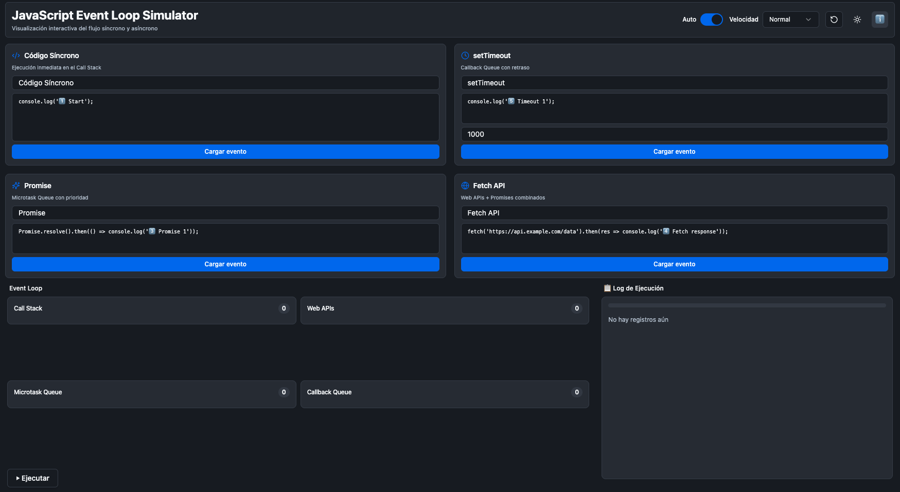
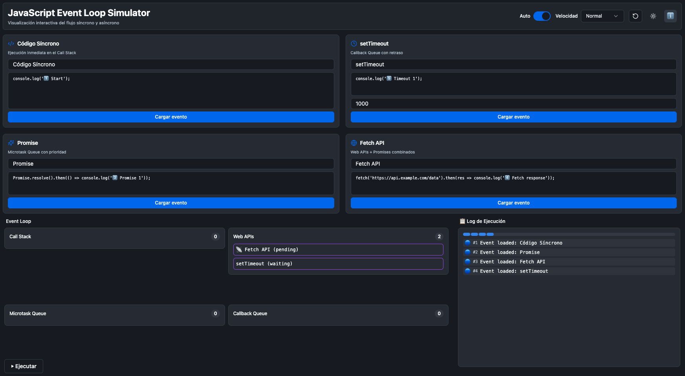
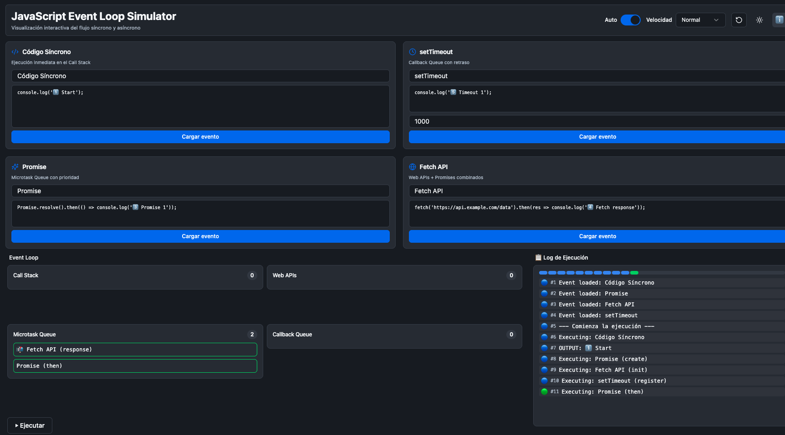
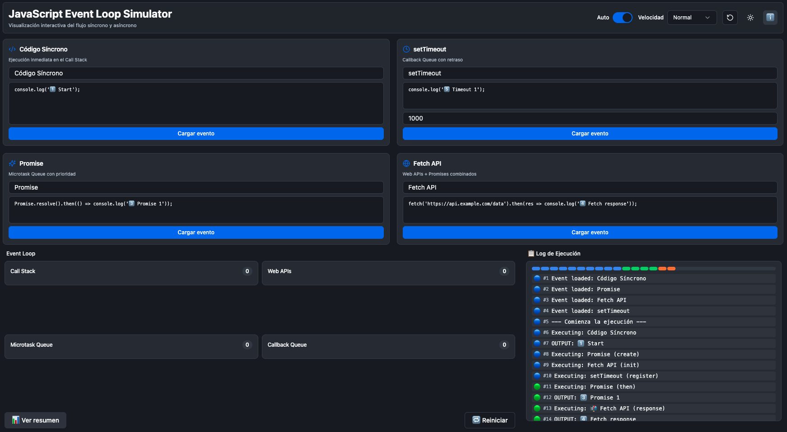
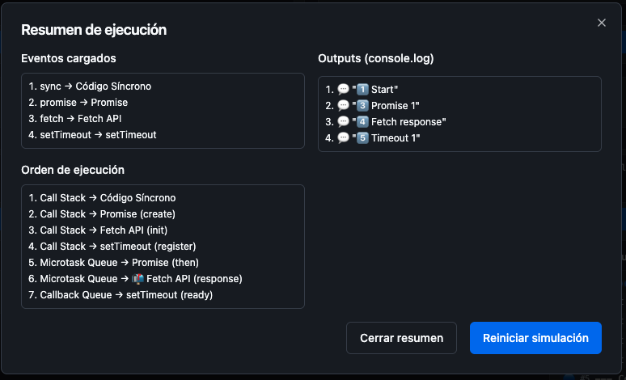

<div align="center">

# JavaScript Event Loop Simulator

[](https://react.dev/)
[](https://www.typescriptlang.org/)
[](https://vitejs.dev/)
[](https://tailwindcss.com/)
[](https://github.com/pmndrs/zustand)
[](#-licencia)

[](https://pmNiko.github.io/JS-Event-Loop-Simulator/)

</div>

## 🧠 Descripción general

Este simulador permite visualizar, de forma interactiva, el flujo real del Event Loop en JavaScript. Muestra cómo interactúan el Call Stack, las Web APIs, la Microtask Queue y la Callback Queue mientras se ejecuta código:

- Síncrono (ejecución inmediata)
- Asíncrono con `setTimeout`
- Promesas (`Promise.then`) y la prioridad de la Microtask Queue
- Fetch API como combinación de Web APIs + Promesas

¿Qué problema resuelve? Aprender cómo y por qué se ordenan los resultados en consola. Es ideal para comprender conceptos clave como concurrencia cooperativa, colas y prioridades, y por qué “lo asíncrono” no siempre significa “más rápido”.

Referencias útiles (MDN):
- Event Loop y colas: https://developer.mozilla.org/docs/Web/JavaScript/EventLoop
- `setTimeout`: https://developer.mozilla.org/docs/Web/API/setTimeout
- Promises/Microtasks: https://developer.mozilla.org/docs/Web/JavaScript/Reference/Global_Objects/Promise
- Fetch API: https://developer.mozilla.org/docs/Web/API/Fetch_API

## ⚙️ Características

- **Ejecución paso a paso** del Event Loop.
- **Visualización en tiempo real** del Call Stack, Web APIs, Microtask Queue y Callback Queue.
- **Log detallado** de ejecución con cada transición y salida (console.log).
- **Modo automático o lento** (control de velocidad y ejecución manual).
- **Resumen final** con el orden real de ejecución y outputs.
- **Cambio de idioma** 🇦🇷 Español / 🇺🇸 English - Interfaz completamente bilingüe.

## 🚀 Uso

Requisitos: Node.js LTS y npm.

1. Instalar dependencias

```bash
npm install
```

2. Iniciar modo desarrollo

```bash
npm run dev
```

Abre la URL que aparece en la terminal (por defecto, http://localhost:5173).

## 🧩 Ejemplo de simulación

Caso completo con Sync + Promise + Fetch + setTimeout. Orden esperado de salida en consola:

1️⃣ Start  
2️⃣ Promise resolved  
3️⃣ Fetch response  
4️⃣ Timeout fired

Explicación (resumen):
- El código síncrono va primero en el Call Stack.
- `Promise.then` entra a la Microtask Queue y tiene prioridad sobre callbacks.
- `fetch(...)` pasa por Web APIs (pending) y, cuando resuelve, su `.then(...)` entra como microtarea y se ejecuta antes que los callbacks.
- `setTimeout` registra en Web APIs y, al vencer el tiempo, su callback pasa a la Callback Queue y se ejecuta al final.

## 🖼️ Capturas de pantalla

> Las imágenes se encuentran en `public/screen/` dentro del proyecto.


_1. Estado inicial._


_2. Carga de eventos en Web APIs._


_3. Ejecución en progreso._


_4. Fin de la simulación._


_5. Resumen final._

## 🧱 Tecnologías usadas

- React + TypeScript
- Zustand (estado)
- Tailwind CSS (estilos)
- Vite (build dev/preview)
- shadcn/ui (componentes)

## 🎨 Diseño

Interfaz moderna en modo oscuro por defecto, con foco en la pedagogía: paneles claros, colas bien diferenciadas y log explicativo. Ideal para docentes o estudiantes que quieran “ver” la concurrencia de JavaScript en acción.

## 📄 Licencia

MIT License. Consulta el archivo `LICENSE` si está disponible o revisa el texto de la licencia MIT en https://opensource.org/licenses/MIT.

## 🌟 Créditos

Creado por Nicolás Paneblanco como herramienta didáctica para comprender la concurrencia en JavaScript.
